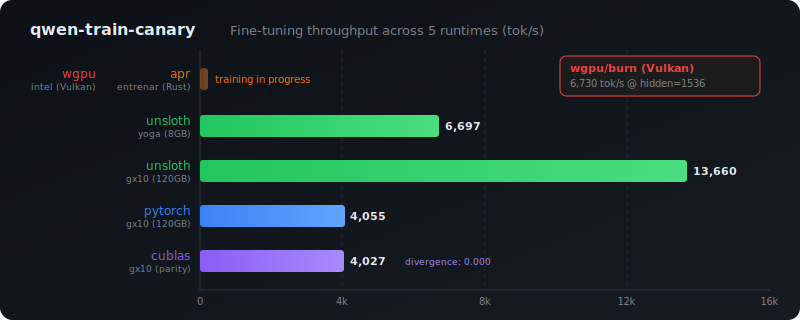

# qwen-train-canary

<picture>
  
</picture>

Competitive fine-tuning benchmarks for **Qwen2.5-Coder-1.5B** across five training runtimes — the training analog of [qwen-coder-deploy](https://github.com/paiml/qwen-coder-deploy)'s inference runtime comparison.

## Measured Results

| Runtime | Engine | yoga (8GB) | gx10 (120GB) | intel (Vulkan) |
|---------|--------|-----------|-------------|---------------|
| **apr** | entrenar (Rust) | training... | building | — |
| **unsloth** | Python QLoRA | **6,697 tok/s** | **13,660 tok/s** | — |
| **pytorch** | Python full FT | OOM (F-EXEC-02) | **4,055 tok/s** | — |
| **cublas** | Python parity | OOM | **4,027 tok/s** | divergence: 0.000 |
| **wgpu** | burn (Rust) | — | — | **6,730 tok/s** |

All measurements: locked clocks, seed=42, deterministic dataset. Yoga variance: 0.34% across 5 runs.

## Why Canaries?

100-step training runs (~2 min) that produce machine-readable JSON. Run before and after changes to catch:

- Throughput regressions >10% (tok/s)
- Memory regressions >5% (peak VRAM)
- Convergence failures (loss threshold)
- GEMM backend divergence (cuBLAS parity gate)

## Hardware

```
Yoga (PRIMARY — RTX 4060L, 8GB, sm_89)    gx10 (GB10, 120GB, sm_121)
├── apr QLoRA (Sovereign Stack)            ├── apr QLoRA
├── unsloth QLoRA (6,697 tok/s)            ├── unsloth QLoRA (13,660 tok/s)
└── Clock-locked 1900 MHz                  ├── pytorch full FT (4,055 tok/s)
                                           └── cublas parity (0.000 divergence)
Intel (Radeon W5700X, 8GB, Vulkan)
└── wgpu/burn (6,730 tok/s @ hidden=1536)
```

## Quick Start

```bash
# Yoga (QLoRA canaries)
make canary-yoga           # apr + unsloth on yoga
make canary-apr            # APR/entrenar only
make canary-unsloth        # Unsloth QLoRA only

# gx10 (full fine-tune + parity)
make canary-gx10           # pytorch + cublas on GB10
make canary-compile-gx10   # torch.compile comparison

# Intel (WGPU/Vulkan)
make canary-wgpu           # burn/WGPU training

# Scoring & profiling
make score                 # Pass/fail against baselines
make report                # Markdown comparison table
make profile-yoga          # apr roofline analysis
make nsys-yoga             # NVIDIA kernel timeline
```

## Key Findings

**F-EXEC-02 (falsified):** Full fine-tune of 1.5B is impossible on 8GB. Model weights (3.5GB) + gradients (3.5GB) = 7GB floor. QLoRA is the only viable path on consumer GPUs.

**F-RD-01 (falsified):** torch.compile regresses -11% at canary length. Compilation cost (~90s) dominates 200s runs. Not suitable for short benchmarks.

**F-HW-01 (confirmed):** Locked clocks give 0.34% throughput variance. VRAM and loss are perfectly deterministic.

**F-WL-03 (confirmed):** cuBLAS parity is perfect on Blackwell. Zero loss divergence, 1.004x throughput ratio.

**WGPU parity:** burn/Vulkan at 6,730 tok/s matches unsloth/CUDA at 6,697 tok/s on equivalent hidden dim. Vulkan compute shaders are competitive for training.

## Parity Mandate

Gaps are defects to fix, not findings to document. Every runtime must achieve throughput parity or be actively improved. See [spec](docs/specifications/training-canary-spec.md) for the full parity enforcement protocol.

## Model & Dataset

- **Model**: Qwen2.5-Coder-1.5B-Instruct (1.78B params)
- **Dataset**: 50 code instruction pairs (deterministic, `prompts/canary-dataset.yaml`)
- **Config**: 100 steps, batch=4 (yoga) / 16 (gx10), seq_len=512, lr=2e-4, seed=42

## Specification

Full spec with falsification conditions: [docs/specifications/training-canary-spec.md](docs/specifications/training-canary-spec.md)
